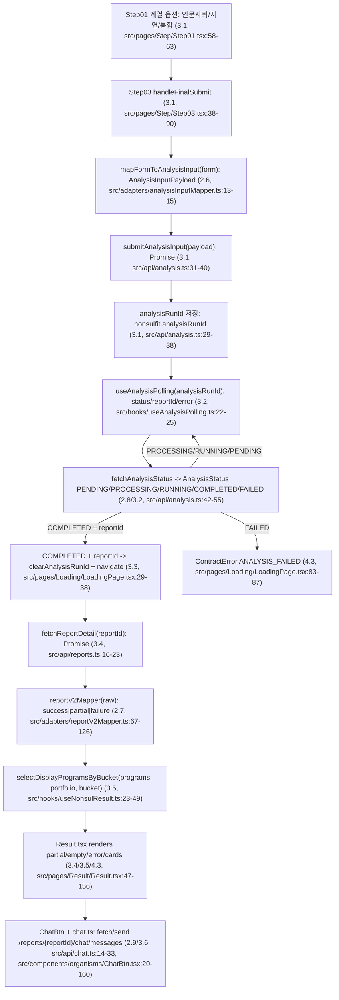
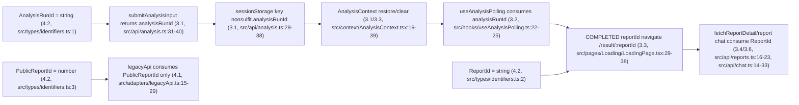
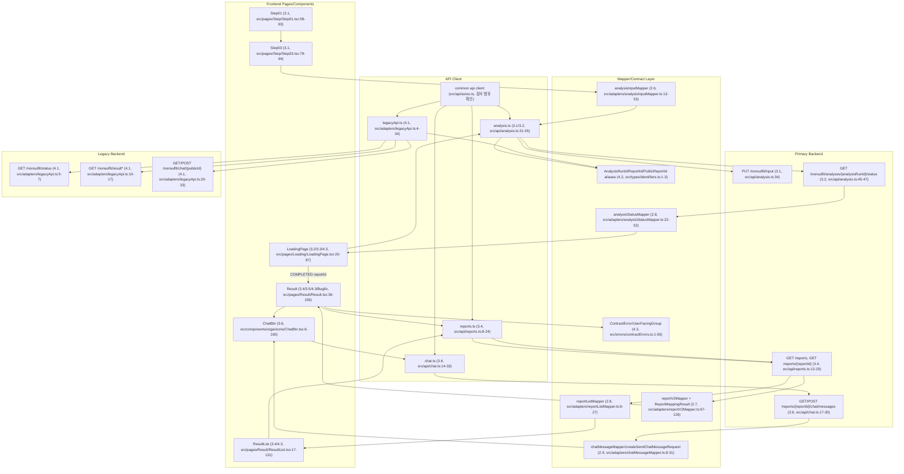

# NonsulFit Contract Migration 감사 보고서

## 1. Executive Summary
- 감사 대상: 16개 단위(Commit 2.6~4.5 15개 + Result.tsx reportId 타입 Bugfix 1개).
- 판정: 완전 통과 7개, 부분 통과 8개, 실패 1개.
- Critical 이슈: 1건. Commit 4.5의 `test:contracts` 스크립트와 CI workflow가 없음(package.json:6-12, CI workflow 미존재).
- High 이슈: 3건. `savedAnalysisReportId` 잔존(src/router/resultRoutes.ts:4), 4.3 로컬 에러 타입 미통합(src/api/analysis.ts:22-27, src/hooks/useAnalysisPolling.ts:5-8), 3.1/3.2/3.4/3.5/4.3 일부 필수 테스트명 미존재(src/adapters/__tests__/*, src/__tests__/contracts/* 감사).
- 실행 검증: `npx tsc -b --noEmit` 통과, `npm run test:contracts` 실패(Missing script), `npm run build` 통과.

## 2. 커밋별 감사 결과 (2.6 ~ Bugfix, 전부)

### 2.6 analysisInputMapper / Fixture
| 항목 | 계약(프롬프트 기준) | 실제 구현 | 상태 | 근거(파일:라인) |
|---|---|---|---|---|
| 파일/타입 | `AnalysisInputPayload`, `TestGradeEntry`, Gender/Academic/ExamType 고정 | payload/type 존재, `OFFICIAL` 없음, `essayCount` 없음 | ✅ | src/contracts/analysisInput.ts:3-39 |
| 함수 시그니처 | `mapFormToAnalysisInput(form): AnalysisInputPayload`, `validateAnalysisInput(payload): AnalysisInputPayload` | 동일 | ✅ | src/adapters/analysisInputMapper.ts:13-15, src/adapters/analysisInputMapper.ts:51-53 |
| 매핑 규칙 | gender UNKNOWN, CSAT/MOCK, 백분위/표준점수 보존, 0등급 거부 | 구현됨 | ✅ | src/adapters/analysisInputMapper.ts:92-96, src/adapters/analysisInputMapper.ts:115-139, src/adapters/analysisInputMapper.ts:213-217 |
| 대표 시험 | 시험 0개 허용, 시험 존재 시 대표 1개 | mapper가 대표 1개로 정규화하고 validator가 검증 | ✅ | src/adapters/analysisInputMapper.ts:79-87, src/adapters/analysisInputMapper.ts:144-157 |
| 필수 테스트 | 10개 이름 존재/pass | `npm test` 45개 pass 중 10개 존재/pass | ✅ | src/adapters/__tests__/analysisInputMapper.test.ts:50-160 |

완료 기준 체크리스트: ✅ Fixture deep-equal(src/adapters/__tests__/analysisInputMapper.test.ts:50-55), ✅ 0등급 거부(src/adapters/__tests__/analysisInputMapper.test.ts:113-118), ✅ `essayCount` payload 없음(src/contracts/analysisInput.ts:11-23), ✅ `OFFICIAL` 없음(src/contracts/analysisInput.ts:9), ✅ 빈 gender UNKNOWN(src/adapters/analysisInputMapper.ts:92-96), ✅ 테스트 pass.  
판정: 완전 통과.

### 2.7 reportV2Mapper / ReportMappingResult
| 항목 | 계약(프롬프트 기준) | 실제 구현 | 상태 | 근거(파일:라인) |
|---|---|---|---|---|
| DTO/Canonical 분리 | `generatedReportV2`/`generated_report_v2`에서 본체 추출, 이중 래핑 금지 | 추출 함수 존재 | ✅ | src/contracts/reportResponse.ts:3-6, src/adapters/reportV2Mapper.ts:58-65 |
| 3-state union | success/partial/failure 보존 | 동일 | ✅ | src/contracts/reportResponse.ts:13-16 |
| 12개 섹션 보존 | 기존 ReportPayloadV2 섹션 유지 | 12개 섹션 존재 | ✅ | src/types/reportPayloadV2.ts:22-35 |
| displayBucket | portfolio safety/match/reach -> stable/target/reach, category primary 사용 금지 | displayBucket 우선순위 및 portfolio lookup 사용, category는 별도 보존 | ✅ | src/adapters/reportV2Mapper.ts:88-94, src/adapters/reportV2Mapper.ts:209-218 |
| 타입 세부 | `reportVersion: "v2"` 기대 | 실제 `reportVersion: string` | 부분 | src/types/reportPayloadV2.ts:22-23 |
| 필수 테스트 | 11개 이름 존재/pass | 11개 + determinism 테스트 존재/pass | ✅ | src/adapters/__tests__/reportV2Mapper.test.ts:44-163 |

완료 기준 체크리스트: ✅ Fixture 정규화(src/adapters/__tests__/reportV2Mapper.test.ts:44-56), ✅ 신규 mapper 코드의 snake_case 직접 참조는 계약 파일/mapper 한정(src/contracts/reportResponse.ts:4-5, src/adapters/reportV2Mapper.ts:61-62), ✅ category 변경이 카드 위치 변경 안 함(src/adapters/__tests__/reportV2Mapper.test.ts:119-153), ✅ invalid program은 partial(src/adapters/__tests__/reportV2Mapper.test.ts:110-117), 부분 `reportVersion` literal 타입 미고정.  
판정: 부분 통과.

### 2.8 analysisStatusMapper / reportListMapper
| 항목 | 계약(프롬프트 기준) | 실제 구현 | 상태 | 근거(파일:라인) |
|---|---|---|---|---|
| AnalysisStatus | PENDING/PROCESSING/RUNNING/COMPLETED/FAILED | 동일 | ✅ | src/contracts/analysisStatus.ts:1-6 |
| 비완료 reportId | null 정규화 + warning, throw 금지 | 구현됨 | ✅ | src/adapters/analysisStatusMapper.ts:42-52 |
| COMPLETED reportId | 필수, 없으면 error | 구현됨 | ✅ | src/adapters/analysisStatusMapper.ts:38-40 |
| ReportList envelope | 배열 직접, 객체 reports > result > items | 구현됨 | ✅ | src/adapters/reportListMapper.ts:16-27 |
| 날짜 처리 | `new Date(iso)` 후 Invalid Date null | 구현됨, regex split 없음 | ✅ | src/adapters/reportListMapper.ts:67-72 |
| 필수 테스트 | 12개 이름 존재/pass | 모두 존재/pass | ✅ | src/adapters/__tests__/analysisStatusMapper.test.ts:17-53, src/adapters/__tests__/reportListMapper.test.ts:25-86 |

완료 기준 체크리스트: ✅ PROCESSING 보존, ✅ COMPLETED에서만 reportId 필수, ✅ reports > result > items, ✅ 기존 item 필드 보존(`[key: string]`), ✅ Invalid Date null.  
판정: 완전 통과.

### 2.9 chatMessageMapper / createSendChatMessageRequest
| 항목 | 계약(프롬프트 기준) | 실제 구현 | 상태 | 근거(파일:라인) |
|---|---|---|---|---|
| DTO/ViewModel 분리 | Backend `{type,message}` -> VM `{role,content}` | 구현됨 | ✅ | src/contracts/chat.ts:1-24, src/adapters/chatMessageMapper.ts:8-18 |
| request serializer | `{ message: content }`만 반환 | 구현됨 | ✅ | src/adapters/chatMessageMapper.ts:27-31 |
| warnings/status | warnings 항상 배열, status 보존 | 구현됨 | ✅ | src/adapters/chatMessageMapper.ts:16-17 |
| Date | 없거나 invalid면 null | 구현됨 | ✅ | src/adapters/chatMessageMapper.ts:33-38 |
| 필수 테스트 | 8개 이름 존재/pass | 모두 존재/pass | ✅ | src/adapters/__tests__/chatMessageMapper.test.ts:24-93 |

완료 기준 체크리스트: ✅ DTO/VM 분리, ✅ `{message}` only, ✅ role/content 요청 없음, ✅ warnings 배열 보존, ✅ ChatBtn 직접 DTO 사용은 3.6에서 제거됨(src/components/organisms/ChatBtn.tsx:126-147).  
판정: 완전 통과.

### 3.1 submitAnalysisInput / Step01 계열 옵션
| 항목 | 계약(프롬프트 기준) | 실제 구현 | 상태 | 근거(파일:라인) |
|---|---|---|---|---|
| Step03 payload | 직접 조립 금지, mapper만 사용 | `mapFormToAnalysisInput` 호출. 단 `studentInfo.essayCount`를 `applicationCount`로 경계 변환 | 부분 | src/pages/Step/Step03.tsx:79-88 |
| submit 함수 | `submitAnalysisInput(payload): Promise<AnalysisSubmissionResult>` | 구현됨, PUT `/nonsulfit/input`, unknown 파싱 | ✅ | src/api/analysis.ts:31-40, src/api/analysis.ts:58-69 |
| analysisRunId 저장 | 성공 직후 sessionStorage 저장, 실패 시 저장 없음 | 파싱 성공 후 저장. 실패 시 throw되어 저장 전 중단 | ✅ | src/api/analysis.ts:34-38, src/api/analysis.ts:64-68 |
| Step01 계열 | "예체능 계열" 제거, "통합" 추가 | 구현됨 | ✅ | src/pages/Step/Step01.tsx:58-63 |
| 필수 테스트 | 8개 이름 존재/pass | 명시 테스트명 미존재 | ❌ | src/adapters/__tests__/* 및 src/__tests__/contracts/* 감사 |

완료 기준 체크리스트: ✅ Step03 mapper 사용, ✅ analysisRunId 없이 Loading 이동 없음(src/pages/Step/Step03.tsx:90-94), ✅ Step01 계열 옵션, 부분 `essayCount` 참조가 Step03 경계에 잔존(src/pages/Step/Step03.tsx:82), ❌ 필수 테스트명 미존재.  
판정: 부분 통과.

### 3.2 useAnalysisPolling
| 항목 | 계약(프롬프트 기준) | 실제 구현 | 상태 | 근거(파일:라인) |
|---|---|---|---|---|
| hook 시그니처 | `useAnalysisPolling(analysisRunId, options?)` 반환 status/reportId/error | 구현됨 | ✅ | src/hooks/useAnalysisPolling.ts:22-25, src/hooks/useAnalysisPolling.ts:147 |
| URL | `/nonsulfit/analyses/{analysisRunId}/status`, ID 없으면 호출 금지 | 구현됨 | ✅ | src/api/analysis.ts:42-47, src/hooks/useAnalysisPolling.ts:33-37 |
| PROCESSING | polling 계속 | 계속 schedule | ✅ | src/hooks/useAnalysisPolling.ts:106-111 |
| HTTP vs FAILED | FAILED는 ANALYSIS_FAILED, HTTP는 MAX_ERRORS/TIMEOUT | 구분됨 | ✅ | src/hooks/useAnalysisPolling.ts:86-92, src/hooks/useAnalysisPolling.ts:112-127 |
| 필수 테스트 | 7개 이름 존재/pass | 명시 테스트명 미존재, 4.4 regression 일부만 존재 | ❌ | src/__tests__/contracts/analysisFlow.contract.test.ts:56-63 |

완료 기준 체크리스트: ✅ URL에 analysisRunId 포함, ✅ PROCESSING 지속, ✅ unmount timer 취소(src/hooks/useAnalysisPolling.ts:135-139), ✅ 중복 요청 방지(src/hooks/useAnalysisPolling.ts:69-80), ❌ 필수 hook 테스트명 미존재.  
판정: 부분 통과.

### 3.3 reportId 획득 / Route / sessionStorage 정리
| 항목 | 계약(프롬프트 기준) | 실제 구현 | 상태 | 근거(파일:라인) |
|---|---|---|---|---|
| route | canonical `/result/:reportId`, Number 변환 금지 | route helper 구현, Number(reportId) 없음 | ✅ | src/router/resultRoutes.ts:5-8, src/pages/Result/Result.tsx:36-40 |
| 완료 시 이동 | COMPLETED+reportId로 결과 이동 | 구현됨 | ✅ | src/pages/Loading/LoadingPage.tsx:29-38 |
| sessionStorage 정리 | COMPLETED 후 key 삭제, FAILED 보존 | COMPLETED에서 clear, FAILED 경로 삭제 없음 | ✅ | src/pages/Loading/LoadingPage.tsx:29-38, src/context/AnalysisContext.tsx:34-39 |
| reportId 누락 | error 처리 | ContractError로 처리 | ✅ | src/pages/Loading/LoadingPage.tsx:77-79 |
| 금지 패턴 | savedAnalysisReportId 재도입 금지(후속 4.2 기준 포함) | 주석 잔존 | ❌ | src/router/resultRoutes.ts:4 |
| 필수 테스트 | 6개 이름 존재/pass | 명시 테스트명 미존재 | ❌ | src/__tests__/contracts/* 감사 |

완료 기준 체크리스트: ✅ max-id 추정 0건, ✅ reportId Number 변환 0건, ✅ publicId fallback 없음, ✅ COMPLETED clear/FAILED 보존, ❌ savedAnalysisReportId 주석 잔존, ❌ 필수 테스트명 미존재.  
판정: 부분 통과.

### 3.4 fetchReportDetail / fetchReportList / useNonsulResult
| 항목 | 계약(프롬프트 기준) | 실제 구현 | 상태 | 근거(파일:라인) |
|---|---|---|---|---|
| API signatures | `fetchReportList`, `fetchReportDetail(reportId): ReportMappingResult` | 구현됨 | ✅ | src/api/reports.ts:8-24 |
| endpoint | GET `/reports`, GET `/reports/{reportId}` | 구현됨 | ✅ | src/api/reports.ts:12-20 |
| mapper 경유 | list/detail mapper 통과, partial 보존 | 구현됨 | ✅ | src/api/reports.ts:1-4, src/api/reports.ts:12-23 |
| hook | `useNonsulResult(reportId)` result/loading/networkError 분리 | 구현됨 | ✅ | src/hooks/useNonsulResult.ts:51-100 |
| Result envelope 직접 접근 | `generated_report_v2` 직접 접근 0건 | 직접 접근 없음. local 변수명 `generatedReportV2`는 canonical data alias | ✅ | src/pages/Result/Result.tsx:45-60 |
| 필수 테스트 | 6개 이름 존재/pass | 명시 테스트명 미존재, 4.4 regression 일부만 존재 | ❌ | src/__tests__/contracts/legacyIsolation.contract.test.ts:42-47 |

완료 기준 체크리스트: ✅ envelope 직접 해석 없음, ✅ useNonsulResult reportId만 입력, ✅ partial/failure 보존, ❌ 필수 테스트명 미존재.  
판정: 부분 통과.

### 3.5 selectDisplayProgramsByBucket / Result.tsx 포트폴리오 보존
| 항목 | 계약(프롬프트 기준) | 실제 구현 | 상태 | 근거(파일:라인) |
|---|---|---|---|---|
| 함수 시그니처 | programs, portfolio, bucket stable/target/reach/all | 구현됨 | ✅ | src/hooks/useNonsulResult.ts:23-27 |
| all 소문자 | uppercase reject | 구현됨 | ✅ | src/hooks/useNonsulResult.ts:28-39 |
| slice 금지 | 임의 개수 제한 금지 | `selectedLimit`/`.slice(0, limit)` 없음 | ✅ | src/__tests__/contracts/reportFlow.contract.test.ts:90-102 |
| 원본 순서 | filter 기반 하위 집합 반환 | 구현됨 | ✅ | src/hooks/useNonsulResult.ts:37-48 |
| UI 연결 | Result filter -> stable/target/reach | 구현됨 | ✅ | src/pages/Result/Result.tsx:27-31, src/pages/Result/Result.tsx:55-59 |
| 필수 테스트 | 6개 이름 존재/pass | 정확한 명시 테스트명 대부분 미존재, 4.4 regression 일부 존재/pass | 부분 | src/__tests__/contracts/reportFlow.contract.test.ts:90-114 |

완료 기준 체크리스트: ✅ 직접 URL/새로고침은 reportId 기반 동일 hook 사용(src/pages/Result/Result.tsx:36-45), ✅ slice 없음, ✅ 원본 filter, ✅ portfolio IDs 사용, 부분 필수 테스트명 미일치.  
판정: 부분 통과.

### 3.6 ChatBtn / chat.ts
| 항목 | 계약(프롬프트 기준) | 실제 구현 | 상태 | 근거(파일:라인) |
|---|---|---|---|---|
| props | `reportId` 단일 식별자 | 구현됨 | ✅ | src/components/organisms/ChatBtn.tsx:6-10 |
| API | common api client, `/reports/{reportId}/chat/messages` | 구현됨 | ✅ | src/api/chat.ts:12-33 |
| request body | `createSendChatMessageRequest` 사용 | 구현됨 | ✅ | src/api/chat.ts:24-31 |
| optimistic user | 사용자 메시지 로컬 생성, assistant 응답 append | 구현됨 | ✅ | src/components/organisms/ChatBtn.tsx:47-64 |
| warnings | 채팅 UI 별도 영역 | 구현됨 | ✅ | src/components/organisms/ChatBtn.tsx:152-160 |
| 필수 테스트 | 7개 이름 존재/pass | 일부는 4.4 regression/2.9 test로 대체, 정확한 명시 테스트명 미존재 | 부분 | src/__tests__/contracts/chatFlow.contract.test.ts:46-79 |

완료 기준 체크리스트: ✅ reportId만 받음, ✅ legacy chat endpoint 호출 없음, ✅ UI 내부 type/message 직접 참조 없음, ✅ role/content 전송 없음.  
판정: 완전 통과(테스트명은 부분 편차이나 기능 완료 기준 충족).

### 4.1 legacyApi.ts / legacyResultMapper
| 항목 | 계약(프롬프트 기준) | 실제 구현 | 상태 | 근거(파일:라인) |
|---|---|---|---|---|
| 5개 legacy ops | getStatus/getResultList/getResultDetail/getChatHistory/sendChatMessage | 구현됨 | ✅ | src/adapters/legacyApi.ts:4-34 |
| URL 격리 | 5개 legacy URL은 legacyApi.ts만 | runtime source는 legacyApi에 격리. 단 contract tests에 문자열 반복 존재 | 부분 | src/adapters/legacyApi.ts:6-29, src/__tests__/contracts/legacyIsolation.contract.test.ts:37-55 |
| getStatus | path parameter 없음 | 구현됨 | ✅ | src/adapters/legacyApi.ts:5-7 |
| legacyResultMapper | `legacyResultMapper(raw): ReportPayloadV2` | 구현됨 | ✅ | src/adapters/legacyResultMapper.ts:1-6 |
| feature flag | 신규 인프라 금지 | 신규 feature flag 없음 | ✅ | 전체 rg 감사 |
| 필수 테스트 | 4개 이름 존재/pass | `legacyApi_exposes...`만 존재, isolation regression 존재. 정확한 4개 명시명 미완비 | 부분 | src/__tests__/contracts/legacyIsolation.contract.test.ts:15-55 |

완료 기준 체크리스트: 부분 `/nonsulfit/result` 및 `/nonsulfit/chat` runtime source는 legacyApi 한정이나 테스트 파일에 문자열 존재, ✅ 신규 Feature Flag 없음.  
판정: 부분 통과.

### 4.2 identifiers.ts (Type Alias)
| 항목 | 계약(프롬프트 기준) | 실제 구현 | 상태 | 근거(파일:라인) |
|---|---|---|---|---|
| alias only | AnalysisRunId/ReportId/PublicReportId | 구현됨 | ✅ | src/types/identifiers.ts:1-3 |
| primary flow | ReportId string 사용 | 구현됨 | ✅ | src/api/reports.ts:5-20, src/api/chat.ts:11-30, src/components/organisms/ChatBtn.tsx:4-10 |
| legacy boundary | PublicReportId는 legacyApi에서 number | 구현됨 | ✅ | src/adapters/legacyApi.ts:2-29 |
| savedAnalysisReportId | primary flow 0건 | 주석 1건 잔존 | ❌ | src/router/resultRoutes.ts:4 |
| Branded Type | 도입 금지 | 없음 | ✅ | src/types/identifiers.ts:1-3 |
| 필수 테스트 | 4개 이름 존재/pass | 명시 테스트명 미존재, 4.4 regression 일부 존재 | ❌ | src/__tests__/contracts/legacyIsolation.contract.test.ts:42-47 |

완료 기준 체크리스트: 부분 Primary Flow reportId 사용, ✅ publicId 신규 report/chat API 미전달(src/api/reports.ts:16-23, src/api/chat.ts:24-33), ❌ savedAnalysisReportId 0건 미충족, ✅ Brand 없음.  
판정: 부분 통과.

### 4.3 contractErrors.ts / UserFacingErrorGroup
| 항목 | 계약(프롬프트 기준) | 실제 구현 | 상태 | 근거(파일:라인) |
|---|---|---|---|---|
| 9개 error type | 정확히 9개 | 구현됨 | ✅ | src/errors/contractErrors.ts:1-10 |
| 5개 user group | mapping 구현 | 구현됨 | ✅ | src/errors/contractErrors.ts:12-17, src/errors/contractErrors.ts:31-56 |
| UI components | ContractErrorState, Empty, Partial | 구현됨 | ✅ | src/components/organisms/common/ContractErrorState.tsx:12-64, src/components/organisms/result/ReportEmptyState.tsx:1-31, src/components/organisms/result/ReportPartialState.tsx:1-20 |
| 로컬 에러 통합 | 이전 로컬 error 타입 통합 | `AnalysisRunIdMissingError`와 `PollingError` 타입 잔존 | ❌ | src/api/analysis.ts:22-27, src/hooks/useAnalysisPolling.ts:5-8 |
| UI 분기 | empty/partial/failure/network 구분 | 구현됨 | ✅ | src/pages/Result/Result.tsx:47-50, src/pages/Result/Result.tsx:77-79, src/pages/Result/Result.tsx:147-153 |
| 필수 테스트 | 6개 이름 존재/pass | 명시 테스트명 미존재 | ❌ | src/adapters/__tests__/*, src/__tests__/contracts/* 감사 |

완료 기준 체크리스트: ✅ 빈 배열은 EmptyState, ✅ invalid payload는 ContractErrorState, ✅ partial은 정상 데이터와 함께 표시, ✅ 9->5 mapping 존재, ❌ 이전 로컬 타입 통합 미완료, ❌ 필수 테스트명 미존재.  
판정: 부분 통과.

### 4.4 __tests__/contracts/*
| 항목 | 계약(프롬프트 기준) | 실제 구현 | 상태 | 근거(파일:라인) |
|---|---|---|---|---|
| 허용 범위 | contract test 4개만 추가 | 4개 존재 | ✅ | src/__tests__/contracts/analysisFlow.contract.test.ts:1, src/__tests__/contracts/reportFlow.contract.test.ts:1, src/__tests__/contracts/chatFlow.contract.test.ts:1, src/__tests__/contracts/legacyIsolation.contract.test.ts:1 |
| regression 항목 | 11개 필수 회귀 검증 | 전부 존재 | ✅ | src/__tests__/contracts/reportFlow.contract.test.ts:35-140, src/__tests__/contracts/analysisFlow.contract.test.ts:56-73, src/__tests__/contracts/chatFlow.contract.test.ts:46-79, src/__tests__/contracts/legacyIsolation.contract.test.ts:25-55 |
| Fixture 재사용 | 기존 Fixture 기반 | 구현됨 | ✅ | src/__tests__/contracts/analysisFlow.contract.test.ts:16-23, src/__tests__/contracts/reportFlow.contract.test.ts:15-22, src/__tests__/contracts/chatFlow.contract.test.ts:22-27 |
| 실행 | direct suite pass | `node --test src/__tests__/contracts/*.test.ts` 18 pass | ✅ | 실행 로그: tests 18/pass 18/fail 0 |

완료 기준 체크리스트: ✅ Contract Suite direct pass, ✅ Primary API Flow legacy 호출 0회 테스트, ✅ render snapshot 안정, ✅ 구현/CI 미수정.  
판정: 완전 통과.

### 4.5 test:contracts CI 스크립트
| 항목 | 계약(프롬프트 기준) | 실제 구현 | 상태 | 근거(파일:라인) |
|---|---|---|---|---|
| package script | `test:contracts` 추가 | 없음 | ❌ | package.json:6-12 |
| CI workflow | 별도 Job/Step 추가 | CI workflow 파일 없음 | ❌ | `.github/workflows` 미존재 감사 |
| 기존 test 유지 | 기존 일반 테스트 제거 금지 | 기존 `test`는 유지됨 | ✅ | package.json:10 |
| 실행 | `npm run test:contracts` 독립 실행 | Missing script 실패 | ❌ | 실행 로그: `npm error Missing script: "test:contracts"` |

완료 기준 체크리스트: ❌ `npm run test:contracts` 없음, ❌ CI 별도 리포팅 없음, ✅ 기존 일반 test 유지.  
판정: 실패.

### Bugfix Result.tsx reportId string|undefined 타입 에러 수정
| 항목 | 계약(프롬프트 기준) | 실제 구현 | 상태 | 근거(파일:라인) |
|---|---|---|---|---|
| useParams guard | `const { reportId } = useParams...`; 없으면 `return null` | 구현됨 | ✅ | src/pages/Result/Result.tsx:36-40 |
| ChatBtn 호출부 | 호출부 자체 수정 없이 guard로 해결 | `<ChatBtn reportId={reportId} />` | ✅ | src/pages/Result/Result.tsx:156 |
| 금지 | `reportId!`, props 완화 금지 | 없음, ChatBtn prop은 `ReportId` | ✅ | src/components/organisms/ChatBtn.tsx:6-10 |
| 실행 | tsc/build 통과 | 통과 | ✅ | 실행 로그: `npx tsc -b --noEmit` exit 0, `npm run build` exit 0 |

완료 기준 체크리스트: ✅ tsc 통과, ✅ build 통과, ✅ ChatBtn 호출부는 reportId 전달 유지, ✅ guard가 호출보다 앞에 있음.  
판정: 완전 통과.

## 3. 커밋 간 일관성 교차 검증 결과
| 항목 | 결과 | 근거 |
|---|---|---|
| 2.7 displayBucket vocabulary vs 3.5 bucket | ✅ 동일. `DisplayBucket = stable/target/reach`, selector bucket은 stable/target/reach/all 소문자 | src/types/reportPayloadV2.ts:3, src/hooks/useNonsulResult.ts:11-27 |
| ReportMappingResult success/partial/failure 전달 | ✅ API에서 mapper 결과를 그대로 반환하고 hook/Result가 status별 분기 | src/contracts/reportResponse.ts:13-16, src/api/reports.ts:16-23, src/hooks/useNonsulResult.ts:75-83, src/pages/Result/Result.tsx:47-50 |
| analysisRunId 저장과 완료 정리 | ✅ submit 성공 후 저장, COMPLETED 후 clear | src/api/analysis.ts:34-38, src/pages/Loading/LoadingPage.tsx:29-38, src/context/AnalysisContext.tsx:34-39 |
| legacyApi 5개 함수 및 URL 격리 | 부분. 5개 함수는 있음. runtime source primary flow에는 legacy URL 없음. 단 contract test 파일에 URL 문자열 존재 | src/adapters/legacyApi.ts:4-34, src/__tests__/contracts/legacyIsolation.contract.test.ts:37-55 |
| identifier alias 경계 | 부분. Primary APIs는 ReportId, legacyApi는 PublicReportId. `savedAnalysisReportId` 주석 잔존 | src/api/reports.ts:5-20, src/api/chat.ts:11-30, src/adapters/legacyApi.ts:2-29, src/router/resultRoutes.ts:4 |
| chat warning response -> ChatBtn 렌더링 | ✅ mapper가 status/warnings 보존, API가 mapper 사용, ChatBtn이 warnings 영역 렌더 | src/adapters/chatMessageMapper.ts:16-17, src/api/chat.ts:24-33, src/components/organisms/ChatBtn.tsx:60-64, src/components/organisms/ChatBtn.tsx:152-160 |
| Bugfix guard 위치와 유사 패턴 | ✅ Result.tsx guard가 ChatBtn 호출 전. `useParams` 사용은 Result.tsx 1곳만 확인 | src/pages/Result/Result.tsx:36-40, src/pages/Result/Result.tsx:156 |

## 4. 실행 검증 결과
- `npx tsc -b --noEmit`: 통과. 출력 없음, exit code 0.
- `npm run test:contracts`: 실패. `npm error Missing script: "test:contracts"`; 실패 테스트명은 없음(스크립트 미정의).
- 참고 직접 실행: `node --test src/__tests__/contracts/*.test.ts` 통과, tests 18/pass 18/fail 0.
- `npm test`: 통과, tests 45/pass 45/fail 0.
- `npm run build`: 통과. `tsc -b && vite build`, 705 modules transformed, build success. Vite chunk size warning은 존재하나 실패 아님.

## 5. 발견된 편차(Deviation) 목록
| 위치 | 계약 | 실제 | 영향도(High/Medium/Low) | 권장 조치 |
|---|---|---|---|---|
| package.json:6-12 | 4.5 `test:contracts` 스크립트 추가 | 스크립트 없음 | High | `scripts.test:contracts`를 별도 커밋에서 추가 |
| CI workflow | 4.5 CI에서 Contract Regression Suite 독립 실행 | workflow 파일 없음 | High | 기존/신규 CI 경로 확정 후 별도 Job/Step 추가 |
| src/router/resultRoutes.ts:4 | `savedAnalysisReportId` 신규 코드 0건 | 주석 1건 잔존 | High | 4.2 후속 정리 커밋에서 제거 |
| src/api/analysis.ts:22-27 | 4.3 로컬 에러 타입 통합 | `AnalysisRunIdMissingError` 잔존 | High | `ContractError("ANALYSIS_RUN_ID_MISSING")` 체계로 통합 |
| src/hooks/useAnalysisPolling.ts:5-8 | 4.3 로컬 에러 타입 통합 | `PollingError` union 잔존 | Medium | hook 반환 정책 유지 여부를 정한 뒤 ContractError 경계로 정리 |
| src/pages/Step/Step03.tsx:82 | 2.6 이후 신규 요청에 `essayCount` 재도입 금지 | FormContext 필드를 mapper 입력 경계에서 `applicationCount`로 변환 | Medium | Form 상태 명칭 마이그레이션 또는 허용된 compatibility 경계로 문서화 |
| src/types/reportPayloadV2.ts:22-23 | `reportVersion: "v2"` | `reportVersion: string` | Low | 타입 literal 강화는 별도 contract 타입 정리 커밋에서 수행 |
| src/__tests__/contracts/legacyIsolation.contract.test.ts:37-55 | legacy URL 문자열 legacyApi.ts 밖 0건 | regression test에 문자열 존재 | Low | runtime source 기준인지 repo 전체 기준인지 명확화, 필요 시 상수화 |
| src/adapters/__tests__/*, src/__tests__/contracts/* | 3.1/3.2/3.4/3.5/4.3 일부 필수 테스트명 | 동일 이름의 테스트 미존재, 기능 회귀 테스트 일부 대체 | Medium | 필수 테스트명 기준 회귀 suite 보강 |

## 6. Risk Summary
1. High: Contract Regression Suite를 CI에서 독립 실행할 수 없음. `npm run test:contracts`가 실패하므로 4.5 완료 기준이 미충족(package.json:6-12).
2. High: `savedAnalysisReportId` 잔존으로 4.2의 primary/legacy ID 분리 완료 기준이 엄격 기준에서 미충족(src/router/resultRoutes.ts:4).
3. High: 4.3 typed Contract Error 통합이 완결되지 않아 로컬 에러 타입이 남아 있음(src/api/analysis.ts:22-27).
4. Medium: 일부 커밋의 필수 테스트명이 정확히 존재하지 않아 프롬프트 기반 감사 추적성이 떨어짐(src/adapters/__tests__/*, src/__tests__/contracts/*).

## 부록 A — Audit 출처 기반 시스템 블루프린트

### A-1. 전체 데이터 흐름 블루프린트


### A-2. ID 생명주기 다이어그램


### A-3. Contract 타입 지도
| 타입명 | 정의 파일 | 정의 커밋 | 주요 소비처 |
|---|---|---|---|
| AnalysisInputPayload | src/contracts/analysisInput.ts:11-23 | 2.6 | src/adapters/analysisInputMapper.ts:13-53, src/api/analysis.ts:31-34 |
| TestGradeEntry | src/contracts/analysisInput.ts:25-39 | 2.6 | src/adapters/analysisInputMapper.ts:115-157 |
| AnalysisStatus | src/contracts/analysisStatus.ts:1-6 | 2.8 | src/adapters/analysisStatusMapper.ts:7-22, src/hooks/useAnalysisPolling.ts:16-25 |
| AnalysisSessionStatus | src/contracts/analysisStatus.ts:8-14 | 2.8 | src/adapters/analysisStatusMapper.ts:22-52 |
| NormalizedReportList | src/contracts/reportList.ts:1-9 | 2.8 | src/adapters/reportListMapper.ts:6-13, src/api/reports.ts:8-13 |
| ReportListItem | src/contracts/reportList.ts:11-18 | 2.8 | src/pages/Result/ResultList.tsx:7-21 |
| ReportMappingResult | src/contracts/reportResponse.ts:13-16 | 2.7 | src/api/reports.ts:16-23, src/hooks/useNonsulResult.ts:51-100, src/pages/Result/Result.tsx:47-79 |
| ReportPayloadV2 | src/types/reportPayloadV2.ts:22-35 | 2.7 | src/adapters/reportV2Mapper.ts:107-135, src/adapters/legacyResultMapper.ts:4-6 |
| DisplayBucket | src/types/reportPayloadV2.ts:3 | 2.7/3.5 | src/hooks/useNonsulResult.ts:11-27 |
| BackendChatMessageDto | src/contracts/chat.ts:1-8 | 2.9 | src/adapters/chatMessageMapper.ts:8-18, src/api/chat.ts:24-33 |
| ChatMessageViewModel | src/contracts/chat.ts:18-24 | 2.9 | src/components/organisms/ChatBtn.tsx:12-64 |
| AnalysisRunId/ReportId/PublicReportId | src/types/identifiers.ts:1-3 | 4.2 | src/api/analysis.ts:5-19, src/api/reports.ts:5-20, src/adapters/legacyApi.ts:2-29 |
| ContractErrorType/UserFacingErrorGroup | src/errors/contractErrors.ts:1-17 | 4.3 | src/components/organisms/common/ContractErrorState.tsx:1-40 |

### A-4. Legacy Isolation 맵
| legacyApi 함수 | Endpoint | 소비/호출 지점 | 감사 결과 |
|---|---|---|---|
| getStatus | GET `/nonsulfit/status` | 감사 범위 내 runtime 소비처 미확인 | src/adapters/legacyApi.ts:5-7 |
| getResultList | GET `/nonsulfit/result` | 감사 범위 내 runtime 소비처 미확인 | src/adapters/legacyApi.ts:10-12 |
| getResultDetail | GET `/nonsulfit/result/{publicId}` | 감사 범위 내 runtime 소비처 미확인 | src/adapters/legacyApi.ts:15-17 |
| getChatHistory | GET `/nonsulfit/chat/{publicId}` | 감사 범위 내 runtime 소비처 미확인 | src/adapters/legacyApi.ts:20-22 |
| sendChatMessage | POST `/nonsulfit/chat/{publicId}` | 감사 범위 내 runtime 소비처 미확인 | src/adapters/legacyApi.ts:25-33 |
| Feature Flag/조건부 호출 | 기존 체계 없음 | 미확인/없음 | rg 감사 결과 feature flag 인프라 없음 |

### A-5. 에러/빈 상태 분기 맵
| ContractErrorType | UserFacingErrorGroup | 렌더링 컴포넌트 | 출처 |
|---|---|---|---|
| ANALYSIS_RUN_ID_MISSING | INPUT_OR_ID_ERROR | ContractErrorState | src/errors/contractErrors.ts:35-37, src/pages/Loading/LoadingPage.tsx:73-75 |
| COMPLETED_REPORT_ID_MISSING | INPUT_OR_ID_ERROR | ContractErrorState | src/errors/contractErrors.ts:35-37, src/pages/Loading/LoadingPage.tsx:77-79 |
| ANALYSIS_FAILED | ANALYSIS_FAILED | ContractErrorState | src/errors/contractErrors.ts:38-40, src/pages/Loading/LoadingPage.tsx:83-87 |
| ANALYSIS_STATUS_INVALID | ANALYSIS_FAILED | ContractErrorState | src/errors/contractErrors.ts:38-40 |
| REPORT_PAYLOAD_INVALID | REPORT_ERROR | ContractErrorState | src/errors/contractErrors.ts:41-44, src/pages/Result/Result.tsx:47-50 |
| REPORT_NOT_FOUND | REPORT_ERROR | ContractErrorState | src/errors/contractErrors.ts:41-44 |
| REPORT_LIST_INVALID | REPORT_ERROR | ContractErrorState | src/errors/contractErrors.ts:41-44, src/pages/Result/ResultList.tsx:23-26 |
| CHAT_PAYLOAD_INVALID | CHAT_ERROR | ContractErrorState | src/errors/contractErrors.ts:45-46 |
| NETWORK_ERROR | NETWORK_ERROR | ContractErrorState | src/errors/contractErrors.ts:47-48, src/pages/Result/Result.tsx:47-50 |
| 정상 빈 추천 목록 | 에러 아님 | ReportEmptyState | src/pages/Result/Result.tsx:147-153 |
| partial report | 에러 아님 | ReportPartialState + 정상 데이터 표시 | src/pages/Result/Result.tsx:77-79, src/components/organisms/result/ReportPartialState.tsx:7-17 |

## 부록 B — 페이지별 와이어프레임 (텍스트 기반, 실제 컴포넌트 트리 기준)

### Step01
```text
Step01 (src/pages/Step/Step01.tsx:9-97)
└─ StepHeader: 기본 정보 입력 (lines 34-39)
└─ SelectionCard 성별 (lines 42-48)
└─ SelectionCard 현재 상태 (lines 50-56)
└─ SelectionCard 계열 선택: 인문사회/자연/통합 (lines 58-64)
└─ FormCard 희망 학과 + Input (lines 66-73)
└─ SelectionCard 목표 지역 (lines 75-81)
└─ SelectionCard 지원 논술 개수, FormContext essayCount (lines 83-89)
└─ StepNavigation nextPath=/step02 (line 92)
```
미확인 요소: 저장 복원 마이그레이션 UI는 감사 범위에서 확인되지 않음.

### Step03
```text
Step03 (src/pages/Step/Step03.tsx:15-130)
└─ handleFinalSubmit
   ├─ required GPA/exam validation (lines 41-77)
   ├─ mapFormToAnalysisInput(...) (lines 79-88)
   ├─ submitAnalysisInput(payload) (line 90)
   └─ success: setAnalysisRunId + navigate /loading (lines 91-94)
└─ StepHeader/FormCard/ScoreInputBox 하위 UI (lines 114-130 이후, 일부 감사)
```
미확인 요소: Step03 전체 하단 UI 세부 트리는 130라인 이후 미확인.

### LoadingPage
```text
LoadingPage (src/pages/Loading/LoadingPage.tsx:9-90)
└─ currentAnalysisRunId = context || route state (lines 15-21)
└─ useAnalysisPolling(currentAnalysisRunId) (line 21)
└─ COMPLETED + reportId
   ├─ clearAnalysisRunId() (line 31)
   └─ navigate(buildResultRoute(reportId)) (lines 32-36)
└─ ContractErrorState
   ├─ ANALYSIS_RUN_ID_MISSING (lines 73-75)
   ├─ COMPLETED_REPORT_ID_MISSING (lines 77-79)
   ├─ ANALYSIS_FAILED (lines 83-85)
   └─ NETWORK_ERROR (line 87)
└─ Loading spinner for active polling (lines 58-63)
```
미확인 요소: polling hook 단위 UI 테스트는 명시 테스트명 미존재.

### Result
```text
Result (src/pages/Result/Result.tsx:34-161)
└─ useParams<{ reportId: ReportId }>() (line 36)
└─ if !reportId return null (lines 38-40)
└─ useNonsulResult(reportId) (line 45)
└─ ContractErrorState for network/failure (lines 47-50, 89-93)
└─ ReportPartialState for result.status === partial (lines 77-79)
└─ Warnings/Risk/NextActions panels when data loaded (lines 81-86)
└─ isLoading spinner (lines 94-100)
└─ recommendedPrograms.length > 0
   ├─ UnivTabs (lines 101-107)
   ├─ UnivDetailSummary (line 108)
   ├─ EvaluationReport (lines 109-112)
   ├─ Tier/Pattern/Case panels (lines 113-125)
   └─ UnivCompetencyComparison (lines 126-129)
└─ else ReportEmptyState (lines 147-153)
└─ ChatBtn reportId={reportId} (line 156)
```
미확인 요소: 각 result organism 내부의 모든 표시 항목은 감사 범위 밖.

### ResultList
```text
ResultList (src/pages/Result/ResultList.tsx:11-137)
└─ useEffect fetchReportList() (lines 17-31)
└─ isLoading spinner (lines 67-73)
└─ ContractErrorState REPORT_LIST_INVALID (lines 74-87)
└─ list.length > 0
   └─ Card list, navigate /result/{reportId} (lines 88-124)
└─ else ReportEmptyState (lines 125-131)
```
미확인 요소: pagination UI는 감사 범위에서 확인되지 않음.

### ChatBtn
```text
ChatBtn (src/components/organisms/ChatBtn.tsx:6-190)
└─ props: reportId only (lines 6-10)
└─ loadChatHistory -> fetchChatHistory(reportId) (lines 20-32)
└─ handleSendMessage
   ├─ optimistic user ChatMessageViewModel (lines 47-54)
   ├─ sendChatMessage(reportId, userMessage) (line 58)
   ├─ warnings state update (lines 60-62)
   └─ assistant message append (line 64)
└─ message render by role user/system/assistant (lines 126-147)
└─ warnings banner (lines 152-160)
└─ input form (lines 173-190)
```
미확인 요소: keyboard/accessibility 상세 동작은 감사 범위 밖.

## 부록 C — 올인원 시스템 구조도

